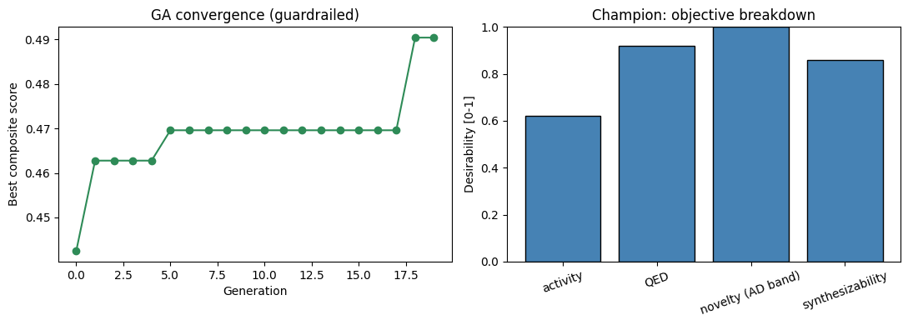
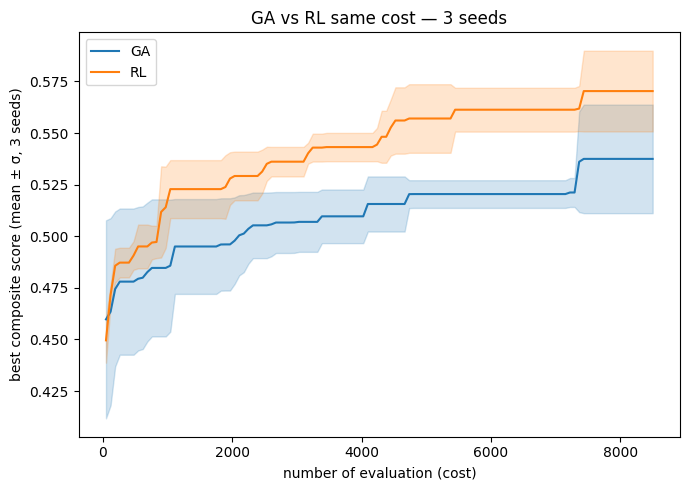
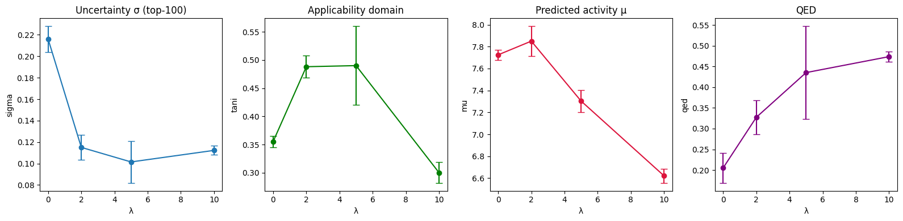
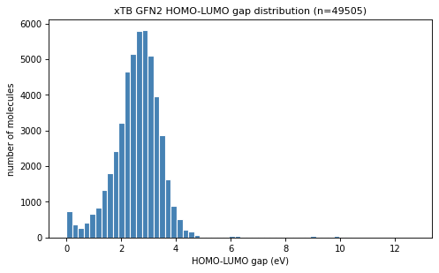
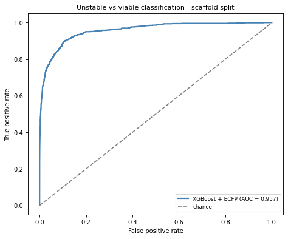
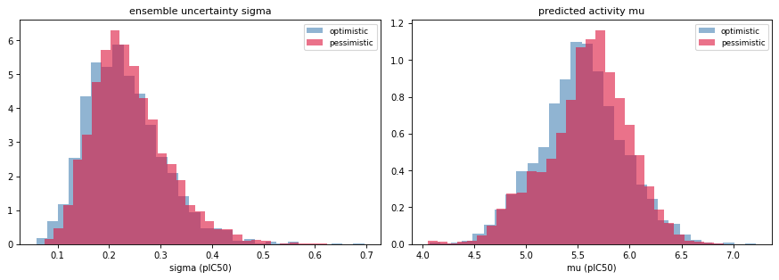
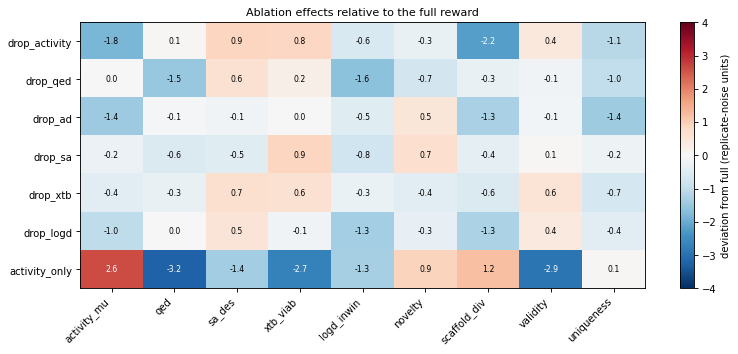

# Cheminformatics & ML

Personal self-taught project exploring Machine Learning applied to chemistry,
built alongside my Master's degree in Chemistry (ENS Paris-Saclay | Sorbonne Université).

## Objective

Explore how ML can be combined with chemical data and molecular descriptors
to predict physicochemical properties, biological activity of molecules from
their structure, and then to design molecules *de novo*. On one hand, the project moves progressively from physicochemical endpoints to structure-activity relationships and a deployed prediction app. On the other hand, it goes from property prediction to de novo molecular generation, where the same predictive models become the reward that guides reinforcement-learning (RL) and evolutionnary generators toward novel, druf-like, EGFR-active candidates. All models are trained on publicly available datasets and evaluated with rigorous protocols (cross-dataset validation, scaffold splits, ablation studies, multi-seed replication,  applicability-domain checks), with explicit reporting of the ceilings imposed by the data.

## Projects

### 01 — Aqueous Solubility Prediction
`notebooks/01_esol_solubility.ipynb`

Prediction of aqueous solubility (logS, mol/L) from molecular structure using
RDKit descriptors and Morgan fingerprints on the ESOL benchmark dataset [1].

**Training protocol:**
All models were trained using an 80/20 random train/test split (random_state=42
for reproducibility). No validation set was used for hyperparameter tuning in
this initial benchmark.
The 6 molecular features used are: LogP, molecular weight, number of H-bond
donors and acceptors, topological polar surface area (TPSA), and number of
aromatic rings. Morgan fingerprints (radius=2, 2048 bits) were added in a
second step and concatenated with the 6 descriptors to form a 2054-dimensional
feature vector.

**Internal benchmark (ESOL test set, n=226):**
| Model | R² | RMSE (log mol/L) |
|---|---|---|
| Linear Regression | 0.765 | 1.054 |
| Random Forest | 0.859 | 0.816 |
| RF + Morgan Fingerprints (r=2, 2048 bits) | 0.866 | 0.795 |
| XGBoost + Morgan Fingerprints | 0.879 | 0.757 |

**Cross-dataset validation (trained on AqSolDB\ESOL, tested on ESOL):**
| Training set | n (train) | Test set | n (test) | R² | RMSE |
|---|---|---|---|---|---|
| ESOL | 902 | ESOL | 226 | 0.879 | 0.757 |
| AqSolDB\ESOL | 9378 | ESOL | 226 | **0.906** | **0.668** |

**Discussion:**
The XGBoost model achieves R²=0.879 and RMSE=0.757 log mol/L on the ESOL
test set, consistent with published results on this benchmark: Delaney [1]
reported RMSE=0.89 with a linear model, and more recent deep learning
approaches achieve RMSE≈0.58 [5]. Our result sits between these two benchmarks,
which is expected given the limited feature set (6 physicochemical descriptors
+ 2D fingerprints) and absence of hyperparameter optimization.

The most predictive individual feature is LogP (lipophilicity), consistent
with the known negative correlation between hydrophobicity and aqueous
solubility. TPSA and H-bond donor/acceptor counts capture polar interactions
that promote solvation. The addition of Morgan fingerprints provides marginal
improvement (+0.7% R²), suggesting that the 6 physicochemical descriptors
already capture most of the relevant variance for this dataset.

Cross-dataset validation reveals that a model trained on the larger AqSolDB
dataset [2] (9378 molecules after removal of ESOL overlap) generalizes better
to external data (R²=0.906, RMSE=0.668), despite lower internal metrics.
This highlights a key principle: internal R² is insufficient to assess
true predictive power — external validation on leak-free datasets is essential.

Performance could be further improved by: (i) incorporating solvation energy
from DFT calculations (shown by Boobier et al. [3] to be the most predictive
descriptor for aqueous solubility), (ii) adding experimental melting point as
a proxy for lattice energy, and (iii) using graph neural networks (GNNs) to
learn structural features directly from molecular graphs rather than
hand-crafted descriptors.

---

### 02 — Organic Solvent Solubility Prediction
`notebooks/02_organic_solvent_solubility.ipynb`

Prediction of logS in three organic solvents (ethanol, benzene, acetone) using
the dataset from Boobier et al. [3]. Three feature sets compared: RDKit
descriptors + Morgan fingerprints, DFT-derived descriptors (14 descriptors
selected from B3LYP/6-31+G(d) calculations), and their combination.

**Training protocol:**
Each solvent was modelled independently. An 80/20 train/test split was applied
per solvent (random_state=42). The 14 DFT descriptors used are those retained
by Boobier et al. after correlation analysis: MW, MP (melting point), molar
volume, solvation free energy (ΔG_solv), dipole moment in solution (solv_dip),
orbital interaction energies (LsoluHsolv, LsolvHsolu), solvent-accessible
surface area (SASA), and partial charge descriptors (O_charges, C_charges,
Het_charges, Most_neg, Most_pos). DFT values were pre-computed at the
B3LYP/6-31+G(d) level with IEFPCM solvation (Gaussian 09 [4]) by Boobier
et al. and used directly from their published dataset.

**XGBoost results by solvent and feature set:**
| Feature set | Ethanol R² | Benzene R² | Acetone R² |
|---|---|---|---|
| RDKit + Morgan Fingerprints | 0.491 | 0.465 | 0.296 |
| DFT descriptors (Boobier et al.) | 0.547 | 0.620 | 0.476 |
| DFT + Morgan Fingerprints | 0.597 | 0.677 | 0.531 |

**Discussion:**
R² values for organic solvents (0.30–0.68) are substantially lower than for
aqueous solubility. Three factors explain this:

1. **Dataset size**: each solvent contains only 370–553 training molecules,
compared to >9000 for the aqueous model. Small datasets increase variance and
limit generalization.

2. **Experimental noise**: Boobier et al. [3] report that ethanol and acetone
data are particularly noisy due to water contamination and solvent volatility,
making R² and RMSE less reliable metrics in these cases. Their own ET models
achieve R²=0.50 (ethanol) and R²=0.42 (acetone), consistent with our results.

3. **Missing descriptors**: melting point is identified by Boobier et al. as
the single most important descriptor for organic solvent solubility, as it
reflects the lattice energy of the solid. It is included in the DFT feature
set here but was not available for the RDKit-only model. Its high importance
explains why the DFT model outperforms the RDKit model particularly in benzene
(+15% R²), where solute-solute interactions dominate.

The benzene model performs best (R²=0.677), consistent with [3], likely
because benzene interactions are dominated by well-captured van der Waals
forces. Performance could be improved by expanding the training set to
additional solvents and incorporating conformational averaging of DFT
descriptors.

---

### 03 — Hydration Free Energy & Lipophilicity Benchmarks
`notebooks/03_freesolv_lipophilicity.ipynb`

Benchmarking the exact same XGBoost + ECFP4 pipeline (unchanged, not re-optimized)
on two further MoleculeNet properties, to test how well the approach generalizes
across different molecular endpoints: hydration free energy (FreeSolv [6], n=642,
ΔG_hyd in kcal/mol) and the octanol/water distribution coefficient (Lipophilicity,
logD at pH 7.4, n=4200).

**Training protocol:**
Identical featurization and models to notebook 01 (2054-dimensional vectors;
Linear Regression, Random Forest, XGBoost with default hyperparameters).
Evaluation uses both RepeatedKFold (5x5, mean ± std) and a Bemis-Murcko scaffold
split. Parameters are deliberately not re-optimized so that any difference
reflects the property and data, not tuning.

**RepeatedKFold results:**
| Dataset | Model | RMSE | R² |
|---|---|---|---|
| FreeSolv (kcal/mol) | Linear Regression | 1.37 | 0.868 |
| | Random Forest | 1.24 | 0.894 |
| | **XGBoost** | **1.12** | **0.913** |
| Lipophilicity (logD) | Linear Regression | 1.20 | ~0.00 |
| | Random Forest | 0.69 | 0.666 |
| | **XGBoost** | **0.705** | **0.656** |

**Scaffold split vs published GNN benchmarks:**
| Dataset | This work (XGBoost, scaffold) | MPNN [7] | D-MPNN [8] | AttentiveFP [9] |
|---|---|---|---|---|
| FreeSolv | RMSE 3.22 | 1.40 | 1.37 | 0.736 |
| Lipophilicity | RMSE 0.815 | 0.672 | 0.555 | 0.578 |

**Discussion:**
Protocol matters. Under random cross-validation, XGBoost on FreeSolv (RMSE 1.12)
already beats the MPNN and D-MPNN benchmarks; but those benchmarks use scaffold
splitting, so the fair comparison is the scaffold number (3.22), which trails all
GNNs. Comparing across protocols would be misleading. On Lipophilicity the pipeline
is genuinely competitive with graph networks.

FreeSolv is the hardest endpoint despite describing a physically simpler process
(gas-to-water, no crystal lattice), because the dataset is small and its
experimental values carry a noise floor of ~0.6 kcal/mol; the best GNN
(AttentiveFP, 0.736) already operates near that floor. A revealing contrast:
linear regression is strong on FreeSolv (R²=0.868, ΔG_hyd nearly additive in the
descriptors) but collapses on logD (R²≈0), which is governed by non-linear,
substructure-specific effects — the same pipeline ranks its models differently
depending on the property, which is the central argument for benchmarking across
several endpoints.

A transfer experiment (Option B) added a logD value predicted by the Lipophilicity
model as an extra feature to the ESOL solubility model. It produced no improvement
(R² 0.898 to 0.899), because the predicted logD is largely redundant (r=0.876) with
the MolLogP descriptor already present — more features help only when they add
non-redundant information.

---

### 04 — From Fixed Fingerprints to Learned Representations (MLP & GNN)
`notebooks/04_neural_network.ipynb`

Notebook 03 showed that on a fixed fingerprint representation, the choice of model
is not the limiting factor. This notebook tests the alternative — learning the
representation from the molecular graph — on the Lipophilicity dataset, building an
MLP and a graph neural network from first principles.

**Training protocol:**
The MLP (PyTorch) is trained on the standardized 2054-dimensional features with
Adam, dropout and weight decay, and early stopping on a validation set. The GNN
(PyTorch Geometric) consumes the molecular graph (one-hot-encoded atom features)
through message-passing layers, global pooling and a linear head, trained with
masked MSE and early stopping. The final ablation is replicated over 5 random
seeds and reported as mean ± std.

**Key results (Lipophilicity, validation RMSE):**
| Model | RMSE |
|---|---|
| MLP on fingerprints (regularized) | ~0.76 |
| GNN, minimal (GCN, 6 raw atom features) | 1.14 |
| **GNN, improved (GraphConv, rich features)** | **0.589 ± 0.024** |

**Ablation study (2x2, 5 seeds, RMSE):**
| Model | Old features (6) | Rich features (29) |
|---|---|---|
| GCN (minimal) | 1.156 ± 0.035 | 0.885 ± 0.056 |
| GraphConv (improved) | 0.876 ± 0.044 | 0.589 ± 0.024 |

**Discussion:**
On the fixed fingerprint, the regularized MLP only matches XGBoost (0.705),
confirming that the representation, not the model, sets the ceiling. A naive GNN
underfits (uniformly high train and validation error), but enriching the atom
features and the architecture brings it to 0.589 ± 0.024, competitive with
published graph networks (D-MPNN 0.555, AttentiveFP 0.578). The replicated ablation
shows that richer features and a stronger architecture each lower the error by
about 0.28 RMSE, roughly equally and additively; an apparent interaction seen on a
single split did not survive replication, a reminder to weigh effects against
noise. A useful diagnostic recurs throughout: a large train/validation gap
indicates overfitting (regularize), while uniformly high error indicates
underfitting (enrich the model).

---

### 05 — Single-Target QSAR (BACE1 & hERG)
`notebooks/05_qsar_single_target.ipynb`

Moving from physicochemical properties to biological activity (pIC50), which is
assay-dependent and noisier. Two therapeutically relevant targets: BACE1
(Alzheimer's disease; MoleculeNet, n=1513) [10] and hERG (cardiotoxicity; curated
from ChEMBL, n=8348) [11].

**Training protocol:**
Same pipeline as before with one added descriptor (number of rotatable bonds,
2055-dimensional vector), motivated by the role of conformational flexibility in
binding. Models: Linear Regression, Random Forest, XGBoost. Evaluation: RepeatedKFold
and Bemis-Murcko scaffold split; hERG is additionally framed as a binary
blocker/non-blocker classification (pIC50 > 5) evaluated by ROC-AUC. hERG data were
curated from ChEMBL (IC50 only, exact relation, biochemical assay type, nanomolar
units, median deduplication per molecule).

**Regression results:**
| Dataset | Model | Protocol | RMSE | R² |
|---|---|---|---|---|
| BACE1 | XGBoost | RepeatedKFold | 0.707 | 0.72 |
| | XGBoost | Scaffold split | 0.847 | 0.40 |
| | RF benchmark [8] | scaffold | 1.07 | - |
| | D-MPNN [8] | scaffold | 0.791 | - |
| hERG | Random Forest | RepeatedKFold | 0.578 | 0.58 |
| | Random Forest | Scaffold split | 0.683 | 0.32 |

**hERG classification:** ROC-AUC = 0.70 (threshold pIC50 > 5).

**Discussion:**
On the matched (scaffold) protocol, XGBoost on BACE1 (RMSE 0.847) beats the published random-forest benchmark (1.07) and approaches the D-MPNN graph network (0.791). Linear regression collapses on BACE1 (pocket-specific, non-linear SAR) but not on hERG, whose blockade has a partly linear dependence on lipophilicity. hERG regression sits close to the ~0.5 log inter-laboratory noise floor, so its modest R² reflects data quality rather than model inadequacy, and reframing it as classification does not create signal that is not there.

An activity-cliff analysis found that 4.2% of structurally similar BACE1 pairs
(Tanimoto > 0.8) differ by more than 2 pIC50 units. Each such cliff is an error no
structure-based model can avoid, imposing a hard ceiling. Consistently,
leakage-aware hyperparameter tuning (search on a training split, evaluation on an
untouched test set) improved BACE1 RMSE only marginally (0.697 to 0.675), confirming
that the data, not the model, is the limiting factor.

---

### 06 — Multi-Target Activity Profiling
`notebooks/06_multitarget_qsar.ipynb`

Predicting a compound's activity profile across nine protein targets simultaneously,
for selectivity and off-target (polypharmacology) assessment. Data for nine targets
(hERG, BACE1, EGFR, CDK2, JAK2, PARP1, BRD4, Aurora A, PIK3CA) were curated from
ChEMBL [12] (~58,000 molecule-target records).

**Training protocol:**
Each target's IC50 data were curated and converted to pIC50 as in notebook 05.
Two strategies were compared: Approach A trains one XGBoost per target; Approach B trains a single XGBoost on all molecule-target pairs with a one-hot target encoding. Both are evaluated on held-out data (stratified by target for B).

**Approach A (per-target) vs Approach B (unified), held-out R²:**
| Target | A (per-target) | B (unified one-hot) |
|---|---|---|
| BRD4 | 0.758 | 0.633 |
| PARP1 | 0.722 | 0.498 |
| PIK3CA | 0.664 | 0.445 |
| JAK2 | 0.659 | 0.516 |
| BACE1 | 0.654 | 0.513 |
| CDK2 | 0.653 | 0.380 |
| EGFR | 0.625 | 0.489 |
| Aurora A | 0.553 | 0.316 |
| hERG | 0.528 | 0.392 |

**Discussion:**
The per-target ensemble outperforms the unified one-hot model on all nine targets.
A one-hot flag is too weak a mechanism to let a single tree model serve proteins with
genuinely different structure-activity relationships: it settles on a compromise that
fits no target as well as its dedicated model. Multi-target learning requires related targets or a mechanism that learns a shared representation with target-specific outputs (a multi-task graph neural network), identified here as the principled next step and left as future work.

A check on known drugs behaved as expected. Gefitinib, an EGFR inhibitor, ranked EGFR as its top predicted target, and aspirin scored low across all nine targets as a negative control. The same check exposed a calibration bias: the Aurora A model predicts high activity for almost any molecule. Cross-target ranking is therefore reliable only when the per-target models are comparably calibrated, which is a further argument for training them jointly.

The per-target ensemble was deployed in the interactive app (see below) and reused as the activity term of the generation reward.

---

## From Prediction to Molecular Design

Having built predictive models, the second half of the project turns them into the
*reward* that steers molecular generators toward novel EGFR-active, drug-like,
synthesizable and physically viable candidates. The same objective is optimized by
several gradient-free paradigms (genetic algorithm, reinforcement learning) and
studied with the same rigor (multi-seed replication, ablations, honest ceilings).

### 07 — Multi-Objective Generation with a Genetic Algorithm
`notebooks/07_generation_genetic_algorithm.ipynb`

A shift from *predicting* properties to *designing* molecules. A genetic algorithm operating on SELFIES [13] strings  optimizes a composite fitness toward EGFR activity.

**Fitness function (`multi_fitness`):** a product of four desirabilities in [0,1] —
predicted EGFR activity (pIC50, XGBoost + ECFP from the notebook 05–06 pipeline),
drug-likeness (QED), synthetic accessibility ((10−SA)/9), and an applicability-domain
term (a Tanimoto window to the training set penalizing both out-of-domain and
trivial-copy molecules). The reward is also gated by hard structural guards (allowed elements
C/N/O/F/S/Cl/Br, MW 150–600, |formal charge| ≤ 1, PAINS/Brenk alerts) that zero any
invalid candidate.

**Discussion:** this notebook defines the reward reused by every downstream generator,
and provides a strong gradient-free baseline against which reinforcement learning is
later compared at equal oracle budget.



**Genetic-algorithm optimization of the composite EGFR objective**. *Left*: the best composite score rises from 0.42 to 0.49 over 20 generations, then plateaus. The score is a product of four bounded desirabilities, so absolute values stay well below 1. *Right*: the per-term desirability breakdown of the top-scoring molecule. Activity is the lowest term, consistent with the ablation result that activity is the binding constraint while the drug-likeness guardrails are easily satisfied.

---

### 08 — De Novo Generation with Reinforcement Learning (REINVENT)
`notebooks/08_generation_reinforcement_learning.ipynb`

The same objective, optimized by a different paradigm. An autoregressive RNN policy (REINVENT 4 [14]), pretrained on PubChem as a prior, is fine-tuned by policy gradient against the notebook-07 reward (DAP loss, σ=128, KL-to-prior regularization).

**Protocol**: Runs use 190 steps and a batch size of 64. The prior emits only valid SMILES, so validity is 100% by construction. The genetic algorithm and reinforcement learning are compared at equal oracle budget over several independent replicates, on reward-independent metrics: predicted activity, QED, synthetic accessibility, and scaffold diversity.

**Discussion**: The pretrained prior already knows how to write valid, drug-like molecules. Reinforcement learning therefore spends its oracle budget on the objective rather than on SMILES grammar. This is the RLHF paradigm applied to molecules: pretrain a generic generator, then steer it with a reward. The prior on its own never favors EGFR actives. The predicted-activity trajectory rises across training steps, which is the reward at work, and it separates what the prior contributes from what the reward adds. A prior-only baseline quantifies that split (see the ablation below).



**RL vs GA comparison** Best composite score against the number of reward evaluations, for the genetic algorithm and reinforcement learning at equal oracle budget. Mean ± 1 SD over 3 seeds.

---

### 09 — Trustworthy Rewards: Pessimism against Reward Hacking
`notebooks/09_pessimistic_reward.ipynb`

A reinforcement-learning agent will exploit an imperfect reward model. It drifts into regions where the QSAR is confidently wrong. This notebook replaces the point-estimate activity term with a lower confidence bound, R = μ − λσ. Here μ and σ are the mean and standard deviation of a bootstrap ensemble of ten XGBoost predictors. The bound penalizes molecules the model rates highly but with high uncertainty.

**Protocol:** A λ ablation (0, 2, 5, 10) was run over multiple replicates. Each run was evaluated on non-circular evidence, namely the ensemble σ, the Tanimoto similarity to the training domain, and QED, rather than on the reward itself.

**Discussion:** This is the molecular analogue of the reward-model-ensemble pessimism used against over-optimization in RLHF [15]. It states the central thesis of the generative arc directly: every predicted term should carry its uncertainty. 



**Lambda ablation study** Ensemble uncertainty σ (top-100), applicability-domain score, predicted activity μ, and QED of the generated molecules as a function of the pessimism strength λ. Mean ± 1 SD over seeds.

---

### 10 — Physical Viability from Quantum Chemistry (Distributed xTB)
`notebooks/10_xtb_viability.ipynb`

Adds a physics-grounded term to the reward: electronic stability, proxied by the
HOMO–LUMO gap. A dataset of GFN2-xTB [16] gaps was computed for ~50,000 drug-like
ChEMBL molecules on the École Polytechnique SLURM cluster (job array of 100 tasks ×
4 cores; single-point GFN2 on an MMFF-optimized 3D conformer per molecule), then used
to train a fast surrogate so the expensive quantum calculation need not run inside the
RL loop.

**Dataset:** 49,505 gaps from 49,999 submitted molecules (99% success).



**xTB dataset visualisation** 

**Surrogate performance (scaffold split):**
| Task | Model | Metric |
|---|---|---|
| Stability classification (gap < 1.5 eV) | XGBoost + ECFP | ROC-AUC **0.957** |
| Gap regression | XGBoost + ECFP | R² 0.640 / RMSE 0.550 eV |
| Gap regression | GNN (GraphConv) | R² 0.484 (0.542 normalized) |



**Discussion:** Classifying molecules as electronically stable or unstable is near-ceiling easy (AUC 0.957). Predicting the exact gap is only modest, and a non-tuned GNN does not beat XGBoost here. The ECFP classifier is therefore adopted as the viability surrogate. The term proves near-non-binding in generation: drug-like molecules are almost always electronically stable, so the guardrail rarely fires (see the ablation). The contribution of this notebook is the end-to-end distributed HPC pipeline and an honest characterization of a cheap but weak safety term.

---

### 11 — Combining Pessimism and Physical Viability in the RL Reward
`notebooks/11_RL_xtb.ipynb`

The first run to combine both new reward terms in a single agent. A REINVENT policy optimizes a reward that multiplies the pessimistic multifitness (the notebook-07 fitness with the raw activity replaced by the lower confidence bound μ − λσ, λ = 2) with the xTB viability guardrail (notebook 10), each implemented as a custom scoring plugin and combined by a geometric mean.

**Protocol**: The REINVENT setup of notebook 08 (190 steps, batch 64). The run is compared to the optimistic multifitness baseline on reward-independent quantities: the ensemble uncertainty σ and the predicted activity μ of the final population (last 25% of steps).

**Discussion**: The agent learns, as the total score and the activity term both rise across steps. Two terms, however, turn out not to bind. The xTB viability term stays near 0.97 from the first step, because molecules drawn from the prior are already electronically stable. Pessimism does not lower uncertainty either: the median σ is 0.231 for the pessimistic run against 0.221 for the optimistic baseline, and the median μ is 5.63 against 5.53, so the two populations are indistinguishable. The cause is structural. At λ = 2 the additive penalty λσ is diluted inside a multiplicative reward of four desirabilities, and the σ landscape is nearly flat across drug-like space, so no low-uncertainty region exists to move toward. This null result motivated the systematic leave-one-out ablation below, which showed that the auxiliary terms are individually redundant but collectively load-bearing.



**Distributions of ensemble uncertainty σ (left) and predicted activity μ (right) over the final generated molecules**

---

### 12 - Reward-Component Ablation
`scoring/scorer.py`, `scripts/generate_runs.py`, `notebooks/12_rl_ablation.ipynb`

The full reward was factored out of the notebooks into a single versioned, importable
module, so that every optimizer (REINVENT here, a MoLeR latent-space optimizer planned
next) calls the *identical* objective under a shared oracle-call budget. Six selectable
terms — pessimistic activity (μ−λσ), QED, applicability domain, synthetic accessibility,
xTB viability, and a logD window (from the notebook-03 Lipophilicity model) — are
combined by a renormalized geometric mean; the module is batch-vectorized and tracks a
cached oracle-call counter for fair budget accounting.

**Ablation study (leave-one-out):** the full 6-term reward plus each single term removed
(7 conditions), each run over 5 independent REINVENT replicates at equal oracle budget
(35 runs), evaluated on **reward-independent, per-term metrics** measured on the
generated molecules (last 25% of steps). Two baselines — prior-only sampling and an
activity-only reward — separate the contribution of the pretrained prior from that of the
reward.

**Effect of removing each term (full vs drop, mean over 5 replicates):**
| Term removed | Target metric | full | drop |
|---|---|---|---|
| activity | predicted μ (pIC50) | 5.65 | 5.45 |
| qed | QED | 0.79 | 0.76 |
| sa | SA desirability | 0.82 | 0.81 |
| xtb | viability | 0.97 | 0.97 |
| logd | fraction in logD window | 0.66 | 0.60 |
| ad | novelty | 0.72 | 0.72 |

**Discussion:** Read one term at a time, most guardrails barely bind. Only activity, and to a lesser extent QED and logD, move their own metric beyond the replicate noise; synthetic accessibility, xTB viability and novelty do not. Read as a group, the guardrails matter. The activity-only reward, which drops all of them, reaches higher activity but pays for it with sharp losses in QED, xTB viability, synthetic accessibility and the logD window. The resolution is redundancy: each guardrail overlaps with the prior, the structural guards and the other terms, so removing any single one is absorbed by the rest, while removing all of them lets the agent trade drug-likeness for raw activity. The honest conclusion is that the auxiliary terms are individually redundant but collectively load-bearing. Activity is also the diversity driver: removing it collapses scaffold diversity, and optimizing it alone gives the most diverse population. Two caveats bound these results. The renormalized geometric mean means a leave-one-out effect mixes term removal with the reweighting of the rest, and five replicates give low power, so only effects beyond the replicate noise are read.



**Ablation effects relative to the full reward**

---

### Streamlit App — Solubility & Target Activity Predictor
`app.py`

Interactive web application with two tabs, predicting from a SMILES string:

- **Solubility**: aqueous logS and solubility in three organic solvents. Water model
  trained on AqSolDB\ESOL (n=9378, XGBoost + Morgan fingerprints).
- **Target Activity**: a biological activity profile (pIC50) across the nine protein
  targets of notebook 06, colour-coded by activity level, with a dedicated hERG
  cardiotoxicity flag (high predicted hERG activity is a safety risk, the opposite of
  an efficacy target).

Both tabs include a Tanimoto-based applicability-domain indicator (Morgan
fingerprints, radius=2) to flag predictions outside the training domain, and a
disclaimer that predictions are for research purposes only, not clinical advice.

```bash
conda activate chemml
cd path/to/cheminformatics
python -m streamlit run app.py
```

---

## Tech Stack

- **RDKit** (2023.09) — molecular manipulation, descriptor calculation, fingerprints
- **scikit-learn** — Linear Regression, Random Forest, model selection, metrics
- **XGBoost** — gradient boosting regressor
- **PyTorch / PyTorch Geometric** — MLP and graph neural network (notebook 04)
- **chembl_webresource_client** — bioactivity data extraction (notebooks 05-06)
- **pandas / numpy** — data manipulation
- **matplotlib / seaborn** — visualization
- **Streamlit** — interactive web application

## References

[1] Delaney, J.S. ESOL: Estimating aqueous solubility directly from molecular
structure. *J. Chem. Inf. Comput. Sci.* **44**, 1000–1005 (2004).
https://doi.org/10.1021/ci034243x

[2] Sorkun, M.C., Khetan, A. & Er, S. AqSolDB, a curated reference set of
aqueous solubility and 2D descriptors for a diverse set of compounds.
*Sci. Data* **6**, 143 (2019). https://doi.org/10.1038/s41597-019-0151-1

[3] Boobier, S., Hose, D.R.J., Blacker, A.J. & Nguyen, B.N. Machine learning
with physicochemical relationships: solubility prediction in organic solvents
and water. *Nat. Commun.* **11**, 5753 (2020).
https://doi.org/10.1038/s41467-020-19594-z

[4] Frisch, M.J. et al. Gaussian 09, Revision D.03. Gaussian, Inc.,
Wallingford CT (2016).

[5] Lusci, A., Pollastri, G. & Baldi, P. Deep architectures and deep learning
in chemoinformatics: the prediction of aqueous solubility for drug-like
molecules. *J. Chem. Inf. Model.* **53**, 1563–1575 (2013).
https://doi.org/10.1021/ci400187y

[6] Mobley, D.L. & Guthrie, J.P. FreeSolv: a database of experimental and
calculated hydration free energies, with input files. *J. Comput.-Aided Mol. Des.*
**28**, 711–720 (2014). https://doi.org/10.1007/s10822-014-9747-x

[7] Wu, Z. et al. MoleculeNet: a benchmark for molecular machine learning.
*Chem. Sci.* **9**, 513–530 (2018). https://doi.org/10.1039/C7SC02664A

[8] Yang, K. et al. Analyzing learned molecular representations for property
prediction. *J. Chem. Inf. Model.* **59**, 3370–3388 (2019).
https://doi.org/10.1021/acs.jcim.9b00237

[9] Xiong, Z. et al. Pushing the boundaries of molecular representation for drug
discovery with the graph attention mechanism. *J. Med. Chem.* **63**, 8749–8760
(2020). https://doi.org/10.1021/acs.jmedchem.9b00959

[10] Subramanian, G. et al. Computational modeling of beta-secretase 1 (BACE-1)
inhibitors using ligand-based approaches. *J. Chem. Inf. Model.* **56**, 1936–1949
(2016). https://doi.org/10.1021/acs.jcim.6b00290

[11] Sanguinetti, M.C. & Tristani-Firouzi, M. hERG potassium channels and cardiac
arrhythmia. *Nature* **440**, 463–469 (2006). https://doi.org/10.1038/nature04710

[12] Zdrazil, B. et al. The ChEMBL Database in 2023: a drug discovery platform
spanning multiple bioactivity data types and time periods. *Nucleic Acids Res.*
**52**, D1180–D1192 (2024). https://doi.org/10.1093/nar/gkad1004

## Reproduce the environment

```bash
conda create -n chemml python=3.10
conda activate chemml
conda install -c conda-forge rdkit
pip install scikit-learn pandas numpy matplotlib seaborn jupyter xgboost streamlit chembl_webresource_client torch torch_geometric
```

## Author

**Nicolas Couret** — M2 Ingénierie Moléculaire du Vivant (IMoV), Sorbonne Université,
as part of my Chemistry curriculum at ENS Paris-Saclay.
A self-taught cheminformatics portfolio (developed with AI assistance) exploring
machine learning for drug discovery.

Contact: [nicolas.couret@ens-paris-saclay.fr](mailto:nicolas.couret@ens-paris-saclay.fr) | [LinkedIn](https://www.linkedin.com/in/nicolas-couret-97b78x/)